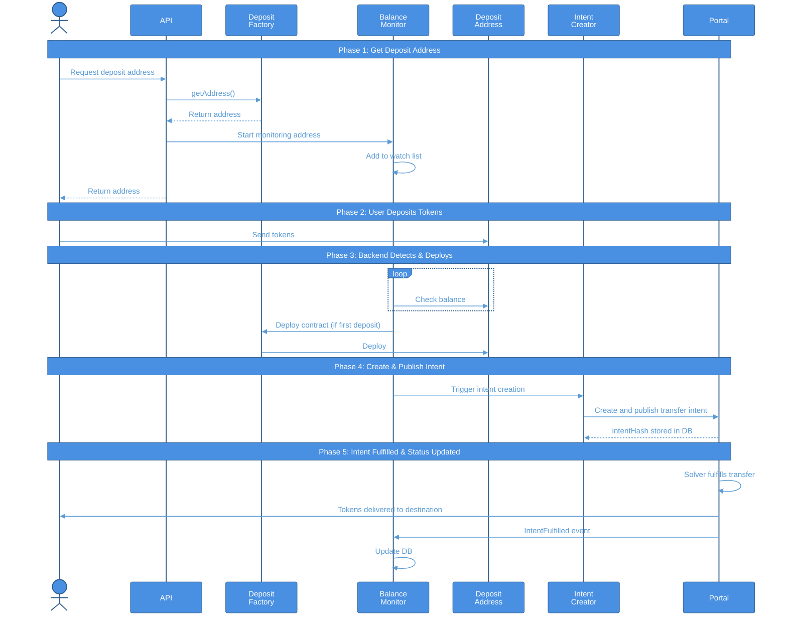

# Deposit Address System - User Flow Diagram

## Mermaid Sequence Diagram

## Flow Description

### Phase 1: Address Discovery
1. User requests their deposit address via Backend API
2. API queries DepositFactory contract to get deterministic address
3. User receives deposit address and configuration

### Phase 2: Token Deposit
4. User sends ERC20 tokens to deposit address (from wallet or CEX)
5. Transaction confirmed on source chain

### Phase 3: Detection & Deployment
6. Balance Monitor polls deposit address every 60 seconds
7. Detects new balance increase
8. Checks if DepositAddress contract is deployed
9. If not deployed (first deposit), Contract Deployer deploys via Factory

### Phase 4: Intent Creation (Simple Transfer Request)
10. Intent Creator calls createIntent() on DepositAddress contract
11. DepositAddress creates a simple transfer intent: "Transfer X tokens from source chain to destination chain"
12. DepositAddress approves Portal for token transfer
13. DepositAddress publishes transfer intent to Routes Portal with recipient details
14. Backend stores intent record in database

### Phase 5: Cross-Chain Transfer Execution
15. Solver network sees the transfer intent
16. Solver accepts the intent and Portal pulls tokens from deposit address
17. Solver executes cross-chain transfer to user's destination address
18. User receives tokens on destination chain
19. Solver submits proof of transfer to Portal
20. Portal verifies proof and pays solver the reward

### Phase 6: Status Tracking
21. Backend monitors Portal IntentFulfilled events
22. Updates database when transfer is complete
23. Status available via API for user queries

## Key Actors

- **End User**: Initiates deposit, receives funds on destination chain
- **Backend API**: Provides deposit address lookup and status queries
- **DepositFactory**: Generates and deploys deterministic deposit contracts
- **Balance Monitor**: Polls for deposits at regular intervals
- **Contract Deployer**: Deploys DepositAddress contracts when needed
- **Intent Creator**: Triggers intent creation after deposit detection
- **DepositAddress**: Smart contract that manages deposits and creates transfer intents
- **Source Chain ERC20 Token**: Token contract on source chain where user deposits
- **Routes Portal**: Protocol contract that publishes transfer intents and manages fulfillment
- **Solver Network**: Decentralized network that executes cross-chain transfers
- **Destination Chain Token**: Token contract on destination chain where user receives funds
