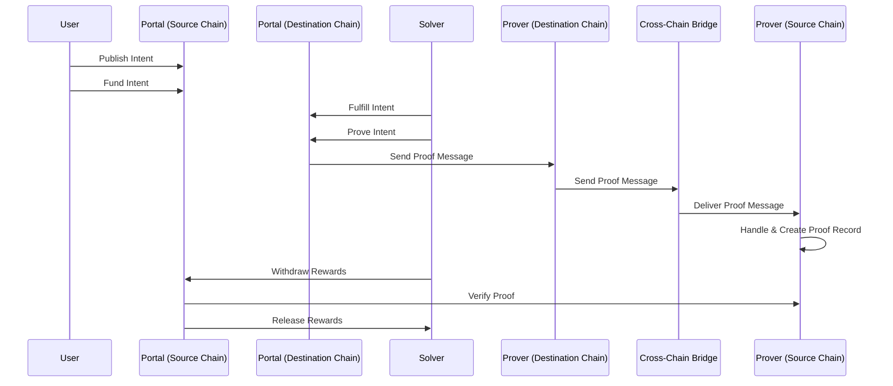

# Eco Routes

An intents-driven, permissionless, trust-neutral protocol for facilitating the creation, incentivized execution, and proof of cross-chain transactions. This implementation supports multiple cross-chain messaging protocols including Hyperlane, LayerZero, and Metalayer.

We identify three main user profiles:

- **Users**: Individuals who want to transact across different chains
- **Solvers**: Individuals interested in performing transactions on behalf of others for a fee
- **Provers**: Individuals interested in proving on the source chain that an intent was fulfilled on the destination chain

## Table of Contents

- [Architecture Overview](#architecture-overview)
- [Setup & Installation](#setup--installation)
- [Development Commands](#development-commands)
- [Contracts](#contracts)
- [Testing](#testing)
- [Deployment](#deployment)
- [Contributing](#contributing)

## Architecture Overview

### How it Works

A **User** wants to initiate a cross-chain transaction by creating an intent. Put simply, an intent represents a **User**'s end goals on the destination chain. It contains the calls they'd want to make, those calls' corresponding addresses, the resources a **Solver** would need to perform those calls, and the rewards the **User** would be willing to pay a **Solver** to execute this call on their behalf, along with other metadata. A **User** can publish this directly on our system or otherwise disseminate that information to a **Solver**. A **User** also must fund this intent - escrow the reward tokens corresponding to the intent. A **Solver**, upon seeing this intent and determining based on the inputs and outputs that it is profitable and ensuring that the **User** has funded the intent, marshalls the required resources and fulfills the intent transaction on the destination chain that corresponds to the user's intent, storing the fulfilled intent's hash on the destination chain. A **Prover** - perhaps the **Solver** themselves or a service they subscribe to - sees this fulfillment transaction and performs a proof that the hash of the fulfilled transaction on the destination chain matches that of the intent on the source chain. After the intent is marked as proven, the **Solver** can withdraw their reward.

### Core Components

#### **Portal Contract** (`contracts/Portal.sol`)

The main intent protocol that manages the complete intent lifecycle:

- **Intent Creation**: Users define cross-chain operations with specific parameters
- **Intent Funding**: Users escrow reward tokens in deterministic vaults to incentivize solver execution
- **Intent Fulfillment**: Solvers execute the requested operations and provide proof
- **Proof Validation**: Validates fulfillment proofs from destination chains via multiple prover types
- **Reward Settlement**: Distributes rewards to successful solvers

#### **Multiple Prover Types**

Specialized provers that integrate with different cross-chain messaging protocols:

- **HyperProver**: Uses Hyperlane for cross-chain message delivery
- **LayerZeroProver**: Integrates with LayerZero protocol for cross-chain verification
- **MetaProver**: Uses Metalayer for cross-chain proofs
- **LocalProver**: Handles same-chain intents

### How They Work Together



1. **Intent Lifecycle**: Portal manages the full intent creation, funding, and fulfillment process
2. **Cross-Chain Messaging**: Multiple prover types handle different bridge protocols for proof delivery
3. **Security**: Each bridge's security module validates cross-chain messages
4. **Vault System**: Deterministic vault creation for reward escrow and settlement

### Key Features

- **ERC-7683 Compatibility**: Full implementation of the cross-chain order standard
- **Multi-Chain Support**: Works with any EVM chain and supports cross-VM integration
- **Multiple Bridge Support**: Hyperlane, LayerZero, and Metalayer integration
- **Solver Incentives**: Reward-based system encourages solver participation
- **Deterministic Addresses**: CREATE2-based deployment for consistent cross-chain addresses
- **ERC20 Integration**: Native permit-based gasless approvals and comprehensive token support
- **Security**: Multi-layered validation through Portal and bridge-specific security modules

### ERC-7683 Integration

Eco Routes implements [ERC-7683](https://eips.ethereum.org/EIPS/eip-7683), the standard for cross-chain order protocols. This enables seamless interoperability with other ERC-7683 compatible systems and provides a standardized interface for cross-chain intent creation and fulfillment.

#### ERC-7683 Components

**EcoERC7683OriginSettler**: The entry point to our system that implements the ERC-7683 standard for intent creation and funding on source chains.

**EcoERC7683DestinationSettler**: An abstract contract inherited by our Portal that handles ERC-7683 compatible intent fulfillment on destination chains.

#### Benefits of ERC-7683 Compatibility

- **Standardized Interface**: Compatible with any ERC-7683 tooling and infrastructure
- **Ecosystem Interoperability**: Works seamlessly with other intent-based protocols
- **Developer Experience**: Familiar patterns for developers already using ERC-7683
- **Future-Proof**: Built on an evolving standard for cross-chain transactions

Users can create and fulfill intents through both our native interface and the standardized ERC-7683 interface, providing maximum flexibility and compatibility.

## Setup & Installation

### Prerequisites

Install the required toolchain components:

#### 1. Install Node.js

```bash
# Install nvm (Node Version Manager)
curl -o- https://raw.githubusercontent.com/nvm-sh/nvm/v0.39.5/install.sh | bash

# Install and use Node.js v18.20.3
nvm install v18.20.3
nvm use v18.20.3
```

#### 2. Install Package Manager

```bash
# Install Yarn v1.22.19
npm install -g yarn@1.22.19
```

#### 3. Install Development Tools

```bash
# Foundry (recommended)
curl -L https://foundry.paradigm.xyz | bash
foundryup

# Alternative: Hardhat is also supported
npm install -g hardhat
```

### Project Setup

#### 1. Clone and Setup

```bash
git clone https://github.com/eco/eco-routes.git
cd eco-routes
```

#### 2. Install Dependencies

```bash
yarn install
```

#### 3. Build the Project

```bash
yarn build
```

## Development Commands

### Building

```bash
# Build all contracts
yarn build

# Build with Foundry
forge build

# Build with Hardhat
npx hardhat compile
```

### Testing

```bash
# Run all tests
yarn test

# Run Foundry tests
forge test

# Run with coverage
yarn coverage

# Run specific test file
forge test --match-contract PortalTest

# Run with test output
forge test -vvv
```

### Code Quality

Run these commands to ensure your code meets standards:

```bash
# Format code
yarn format

# Run linting
yarn lint

# Run all quality checks
yarn lint && yarn test
```

### Development Workflow

```bash
# Start local development environment
# (Configure your local chain setup as needed)

# Deploy contracts locally
forge script script/Deploy.s.sol --broadcast --rpc-url localhost

# Run tests against deployed contracts
forge test --rpc-url localhost
```

## Contracts

### Portal Contract

#### Key Functions:

- `publish` - Create and emit intent on source chain
- `fund` - Fund an intent with reward tokens via deterministic vault
- `fulfill` - Execute intent operations and mark as fulfilled
- `prove` - Submit proof of fulfillment from destination chain
- `refund` - Refund intent if not fulfilled within timeout
- `withdraw` - Withdraw rewards after successful proof validation

#### Key Components:

- **IntentSource**: Manages intent creation, funding, and reward settlement on source chains
- **Inbox**: Handles intent fulfillment on destination chains
- **Vault**: Escrows reward tokens with deterministic addresses via CREATE2
- **Executor**: Secure batch execution of intent calls with comprehensive safety checks

#### Intent Lifecycle Details:

**Intent Publishing**: Intents can be published on any chain, regardless of where input and output tokens live. An intent need not be published via the Portal at all - users can disseminate intent information directly to solvers if they choose.

**Intent Funding**: A funded intent has its reward tokens stored in a deterministic Vault created via CREATE2. Intents can be funded during publishing, after the fact via permit2 signatures, or by directly transferring tokens to the Vault.

**Intent Fulfillment**: Fulfillment happens on the destination chain Portal. Solvers approve the Portal to pull required tokens and call fulfill. Fulfillment may trigger proving-related post-processing, such as relaying a message back to the source chain.

**Intent Reward Settlement**: Settlement occurs on the source chain. The withdrawal flow checks that an intent has been proven and transfers reward tokens to the solver. If an intent was not fulfilled before the deadline, users can trigger a refund. Edge cases like overfunding are handled gracefully.

### Prover Contracts

#### HyperProver Contract

Uses Hyperlane protocol for cross-chain message delivery:

#### Key Functions:

- `prove` - Generate and send proof message via Hyperlane
- `handle` - Process incoming Hyperlane messages and create proof records

#### LayerZeroProver Contract

Integrates with LayerZero protocol:

#### Key Functions:

- `prove` - Generate and send proof message via LayerZero
- `lzReceive` - Process incoming LayerZero messages

### Supporting Contracts

#### Vault Contract

Deterministic reward escrow system:

- Accepts native and ERC20 token deposits
- Releases rewards to proven solvers
- Handles refunds for expired intents

#### Executor Contract

Secure call execution system:

- Only Portal can execute calls
- Prevents dangerous calls to EOAs
- Batch execution with comprehensive error handling

## Testing

### Test Structure

- **Unit Tests**: Located in `test/` directory organized by contract
- **Integration Tests**: End-to-end workflow testing across multiple contracts
- **Security Tests**: Attack vector and edge case testing

### Test Categories

#### Core Contract Tests:

- `Portal.t.sol` - Main portal functionality
- `Vault.t.sol` - Reward escrow and settlement
- `Executor.t.sol` - Secure call execution
- `Inbox.t.sol` - Intent fulfillment workflows
- `IntentSource.t.sol` - Intent creation and funding

#### Prover Tests:

- `HyperProver.t.sol` - Hyperlane integration testing
- `LayerZeroProver.t.sol` - LayerZero integration testing
- `MetaProver.t.sol` - Metalayer integration testing

#### Security Tests:

- `TokenSecurity.t.sol` - Token handling security
- Various attack vector simulations

### Test Patterns

```solidity
contract PortalTest is BaseTest {
  function test_intentFulfillment() public {
    // Setup intent and accounts
    Intent memory intent = createTestIntent();

    // Fund intent
    portal.fund(intent, fundingAmount);

    // Execute fulfillment
    portal.fulfill(intent, solver);

    // Verify success
    assertTrue(portal.isFulfilled(intentHash));
  }
}
```

### Running Specific Tests

```bash
# Run portal-specific tests
forge test --match-contract Portal

# Run prover tests
forge test --match-contract HyperProver

# Run with specific pattern
forge test --match-test test_fulfill
```

## Deployment

### Deployment Commands

#### Local Development:

```bash
# Deploy all contracts locally
forge script script/Deploy.s.sol --broadcast --rpc-url localhost
```

#### Testnet Deployment:

```bash
# Deploy to specific testnet
forge script script/Deploy.s.sol --broadcast --rpc-url $TESTNET_RPC_URL --verify
```

#### Mainnet Deployment:

```bash
# Deploy to mainnet
forge script script/Deploy.s.sol --broadcast --rpc-url $MAINNET_RPC_URL --verify

# Or use deployment script
./scripts/deployRoutes.sh
```

### Cross-VM Support

For cross-VM deployments (e.g., integrating with Solana):

```bash
# Deploy with cross-VM prover support
CROSS_VM_PROVERS="0x1234567890abcdef1234567890abcdef1234567890abcdef1234567890abcdef" ./scripts/deployRoutes.sh

# Multiple cross-VM chains
CROSS_VM_PROVERS="0x1234...solana,0x5678...cosmos" ./scripts/deployRoutes.sh
```

### Environment Configuration

Create `.env` file based on `.env.example`:

```bash
# RPC endpoints
MAINNET_RPC_URL=
TESTNET_RPC_URL=

# Private keys
DEPLOYER_PRIVATE_KEY=

# Etherscan API keys for verification
ETHERSCAN_API_KEY=
```

## Contributing

### Code Standards

1. **Formatting**: Use `yarn format`
2. **Linting**: Pass `yarn lint` without warnings
3. **Testing**: All tests must pass
4. **Documentation**: Document public APIs and complex logic
5. **Security**: Follow best practices and include security tests

### Pull Request Checklist

- [ ] Code formatted (`yarn format`)
- [ ] Linting passed (`yarn lint`)
- [ ] All tests passing (`yarn test`)
- [ ] Coverage maintained or improved
- [ ] Documentation updated for API changes
- [ ] Security implications considered

### Adding New Tests

Follow existing patterns in `test/`:

1. Create test files with descriptive names
2. Use `BaseTest` for common test infrastructure
3. Test both success and failure cases
4. Include security and edge case testing

### Feature Development

1. **Contracts**: Add new contracts in appropriate directories
2. **Cross-Chain Integration**: Follow established prover patterns
3. **Testing**: Add comprehensive unit and integration tests
4. **Documentation**: Update README and inline documentation

---

## Support

For questions or issues:

1. Check existing GitHub issues
2. Review test files for usage examples
3. Examine the contract documentation for technical details

This project implements a production-ready cross-chain intent protocol with comprehensive testing, multi-bridge support, and security-conscious design patterns. The modular architecture allows for easy extension with new bridge protocols while maintaining security and efficiency.
