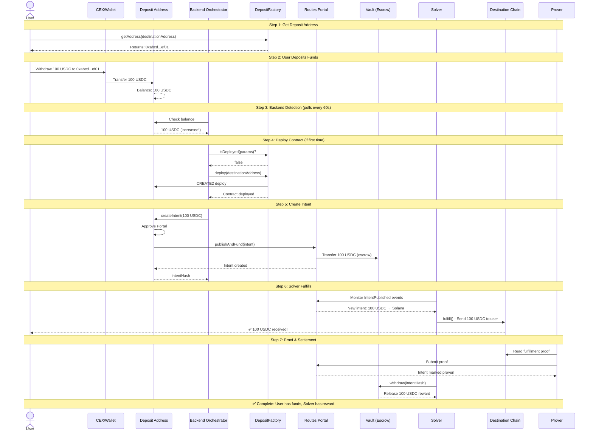

# Deposit Address User Flow

This diagram shows the complete end-to-end user flow for the hardcoded deposit address system, where users get a deterministic address to send tokens for automatic cross-chain bridging.

## User Flow Diagram

## Flow Summary

### User Perspective (Steps 1-2 only)

1. **Get Address**: Request deposit address for destination wallet
2. **Send Tokens**: Transfer tokens from anywhere (CEX, wallet, etc.)
3. **Wait**: Funds appear on destination chain within 1-2 minutes

### Behind the Scenes (Steps 3-7, automated)

3. **Detection**: Backend monitors deposit addresses every 60 seconds
4. **Deployment**: Contract deployed on first use (CREATE2)
5. **Intent Creation**: Backend calls `createIntent()` automatically
6. **Fulfillment**: Solver executes cross-chain transfer
7. **Settlement**: Proof submitted, solver claims reward from vault

## Key Features

- **Deterministic Addresses**: Same input always generates same address (CREATE2)
- **CEX Compatible**: Users can withdraw directly from exchanges
- **Permissionless**: Anyone can trigger deployment and intent creation
- **Automatic**: No user signatures or UI interaction needed after deposit
- **Cross-Chain**: Works for EVM→Solana, EVM→EVM, and other combinations

## Timeline

- Deposit detection: ~30-60 seconds (polling interval)
- Contract deployment: ~15 seconds (first time only)
- Intent creation: ~15 seconds
- Solver fulfillment: ~30-120 seconds
- Proof submission: ~30-60 seconds
- **Total: ~2-4 minutes end-to-end**

## Architecture

**One Factory = One Route**

- Each DepositFactory represents a specific bridge route
- Example: "Ethereum USDC → Solana USDC" factory
- Hard-coded: destination chain, source token, target token
- Variable: only the user's destination address

This design maximizes simplicity and gas efficiency while providing a seamless user experience.
