# LocalProver Information Flow

This document outlines all possible flows when using LocalProver's `flashFulfill` functionality.

## Flow Diagram

```mermaid
flowchart TD
    Start([User Creates Original Intent]) --> IntentType{Intent Type<br/>determined by<br/>user's request}

    %% Single Intent Path
    IntentType -->|Single intent<br/>can be fulfilled locally| Publish1[User calls Portal.publishAndFund<br/>- creator: User<br/>- prover: LocalProver<br/>- funds deposited to OriginalVault]
    Publish1 --> SimpleFlash[Solver calls LocalProver.flashFulfill<br/>- intentHash, route, rewardHash, claimant]
    SimpleFlash --> Withdraw1[LocalProver withdraws from OriginalVault]
    Withdraw1 --> Fulfill1[LocalProver calls Portal.fulfill<br/>- executes route calls]
    Fulfill1 --> FulfillSuccess1{Fulfill Success?}
    FulfillSuccess1 -->|Yes| PaySolver1[LocalProver pays remaining balance<br/>to claimant immediately]
    PaySolver1 --> Done1([✅ Done - Solver has fee])
    FulfillSuccess1 -->|No - Revert| Revert1([❌ Transaction reverts<br/>Funds stay in OriginalVault])

    %% Secondary Intent Path
    IntentType -->|Requires cross-chain<br/>or external action| Publish2[User calls Portal.publishAndFund<br/>- creator: User<br/>- prover: LocalProver<br/>- funds deposited to OriginalVault]
    Publish2 --> CreateSecondary[Solver creates secondary Intent struct<br/>- creator: **LocalProver**<br/>- prover: CrossChainProver<br/>- destination: different chain]
    CreateSecondary --> PublishSecondary[Solver calls Portal.publishAndFund<br/>for secondary intent<br/>- funds SecondaryVault with their own money]
    PublishSecondary --> FlashWithSecondary[Solver calls LocalProver.flashFulfill<br/>- intentHash, route, rewardHash, claimant]
    FlashWithSecondary --> Withdraw2[LocalProver withdraws from OriginalVault]
    Withdraw2 --> Fulfill2[LocalProver calls Portal.fulfill<br/>- executes route calls]
    Fulfill2 --> FulfillSuccess2{Fulfill Success?}
    FulfillSuccess2 -->|No - Revert| Revert2([❌ Transaction reverts<br/>Funds in OriginalVault<br/>Funds in SecondaryVault])
    FulfillSuccess2 -->|Yes| PaySolver2[LocalProver pays remaining balance<br/>to claimant immediately<br/>✅ Solver has fee now!]
    PaySolver2 --> SecondaryOutcome{Secondary Intent<br/>Outcome?}

    SecondaryOutcome -->|Proven successful| SecondarySuccess([✅ Complete Success<br/>- Solver got fee<br/>- Secondary completed<br/>- User got service])

    SecondaryOutcome -->|Expires unproven| SecondaryFailed[Secondary intent deadline passes<br/>without proof]
    SecondaryFailed --> RefundChoice{Who refunds?}

    RefundChoice -->|User wants single-tx| UserRefundBoth[User calls LocalProver.refundBoth<br/>- originalIntent<br/>- secondaryIntent]
    UserRefundBoth --> VerifyCreator{Verify secondaryIntent<br/>creator == LocalProver?}
    VerifyCreator -->|No| RevertBadCreator([❌ Revert: InvalidSecondaryCreator])
    VerifyCreator -->|Yes| VerifyExpired{Verify secondary<br/>expired & unproven?}
    VerifyExpired -->|No| RevertNotExpired([❌ Revert: Not expired or already proven])
    VerifyExpired -->|Yes| RefundSecondary[LocalProver calls Portal.refundTo<br/>- secondaryIntent<br/>- refundee: OriginalVault]
    RefundSecondary --> RefundOriginal[LocalProver calls Portal.refund<br/>- originalIntent]
    RefundOriginal --> BothRefunded([✅ Single-tx refund complete<br/>- User got refund from both vaults<br/>- Solver keeps fee])

    RefundChoice -->|Separate refunds| SeparateRefunds[Anyone can call Portal.refund<br/>on each intent separately]
    SeparateRefunds --> TwoTxRefund([✅ Two-tx refund complete<br/>- User got refund from both vaults<br/>- Solver keeps fee])

    %% Refund Original Only
    Revert1 --> CanRefundOriginal{Original intent<br/>deadline passed?}
    CanRefundOriginal -->|Yes| RefundOrigOnly[User calls Portal.refund<br/>on original intent]
    RefundOrigOnly --> OrigRefunded([✅ User gets original funds back])

    Revert2 --> CanRefundBothSeparate{Deadlines passed?}
    CanRefundBothSeparate -->|Yes| RefundBothSeparate[User calls Portal.refund<br/>on both intents separately]
    RefundBothSeparate --> BothRefundedSeparate([✅ User gets both refunds<br/>in 2 transactions])

    style Done1 fill:#2E7D32
    style SecondarySuccess fill:#2E7D32
    style BothRefunded fill:#2E7D32
    style TwoTxRefund fill:#2E7D32
    style OrigRefunded fill:#2E7D32
    style BothRefundedSeparate fill:#2E7D32
    style PaySolver1 fill:#F57F17
    style PaySolver2 fill:#F57F17
    style Revert1 fill:#C62828
    style Revert2 fill:#C62828
    style RevertBadCreator fill:#C62828
    style RevertNotExpired fill:#C62828
```

## Key Insights

### 1. Solver Always Gets Paid Immediately
- In both simple and secondary intent scenarios, if `flashFulfill` succeeds, the solver receives their fee right away
- This fee is **non-refundable** - solver did the work of fulfilling the original intent

### 2. Single Intent Flow (Simple)
- Solver calls `flashFulfill` → gets fee immediately
- If fulfill fails, transaction reverts and funds stay in vault
- User can refund after deadline if unfulfilled

### 3. Secondary Intent Flow (Complex)
- Solver pre-funds secondary intent with `LocalProver` as creator
- Solver calls `flashFulfill` → gets fee immediately
- Secondary intent outcome is independent:
  - **Success**: Everyone happy
  - **Failure**: User can use `refundBoth()` for single-tx refund, solver keeps their fee

### 4. Refund Scenarios
- **Option A**: User calls `refundBoth()` for single-tx convenience
  - Requires secondary intent creator == LocalProver
  - LocalProver redirects secondary refund to original vault
  - Then refunds original vault
- **Option B**: User calls `Portal.refund()` twice (still works!)
  - Less convenient but always available
  - Each vault refunds separately

### 5. Critical Requirement for `refundBoth()`
The secondary intent **MUST** have `reward.creator = address(LocalProver)` for single-tx refunds to work. If solver creates secondary with themselves as creator, they have to handle refunds themselves.

## Scenarios Summary

### ✅ Success Cases
1. **Simple fulfillment**: Solver gets fee, user gets service
2. **Secondary success**: Solver gets fee, secondary completes, user gets full service
3. **Single-tx refund**: Both vaults refunded to user in one transaction
4. **Two-tx refund**: Both vaults refunded separately

### ⚠️ Solver Keeps Fee Cases
- In all scenarios where `flashFulfill` succeeds, solver keeps their fee
- Even if secondary intent fails, solver earned the fee for fulfilling the original intent
- This is fair: solver did work and fronted capital for secondary intent

### ❌ Revert Cases
1. **flashFulfill fails**: Transaction reverts, funds stay in original vault
2. **Invalid secondary creator**: `refundBoth()` reverts if secondary creator isn't LocalProver
3. **Not expired**: `refundBoth()` reverts if secondary intent hasn't expired yet
4. **Already proven**: `refundBoth()` reverts if secondary intent already proven

## User Experience

### For Users
- Create intent with LocalProver as prover
- Wait for solver to fulfill
- If solver uses secondary intent and it fails: call `refundBoth()` for convenient single-tx refund
- Fallback: can always call `Portal.refund()` on each intent separately

### For Solvers
- Call `flashFulfill` to atomically withdraw + fulfill + get paid
- Get fee immediately (no waiting!)
- If using secondary intent: create it with `reward.creator = address(LocalProver)` for better UX
- Front capital for secondary intent from the fee received

### For Users (Refund Path)
- Single transaction to get all funds back from both vaults
- Permissionless: anyone can trigger the refund
- Graceful fallback: separate refunds always work even if `refundBoth()` requirements aren't met
